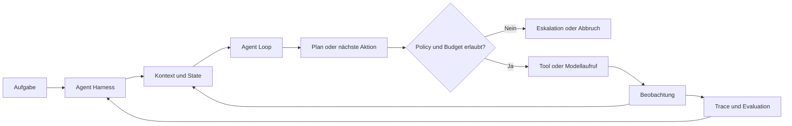

# Agent Harness
{: .no_toc }

> [!NOTE] Kernfrage 
> Welche Infrastruktur sorgt dafür, dass ein Agent nicht nur handeln, sondern kontrolliert, nachvollziehbar und zuverlässig handeln kann?

---

# Inhaltsverzeichnis
{: .no_toc .text-delta }

1. TOC
{:toc}

---

## Was ein Agent Harness leistet

Ein Agent Harness ist die Infrastruktur- und Kontrollschicht um den eigentlichen Agent Loop. Der Loop entscheidet, welches Ziel verfolgt und welcher nächste Schritt vorgeschlagen wird. Das Harness stellt den Laufkontext bereit, begrenzt Aktionen, verwaltet Zustand und Kontext, protokolliert den Ablauf und prüft das Ergebnis.

Damit ist ein Harness größer als ein Prompt und konkreter als die allgemeine Idee eines Agenten-Frameworks. Es verbindet Architektur, Orchestrierung, Laufzeit, Sicherheit, Governance, Observability und Evaluation zu einem kontrollierbaren Ablauf.

Die Trennung ist entscheidend: Ein Modell darf einen Tool-Aufruf vorschlagen, sollte aber nicht allein entscheiden, ob dieser Aufruf zulässig ist. Diese Entscheidung gehört an eine überprüfbare Systemgrenze des Harnesses.

## Warum ein Harness notwendig wird

Ein kurzer Modellaufruf kann häufig als direkte Kette behandelt werden: Eingabe, Modell, Ausgabe. Bei mehrstufigen Aufgaben entstehen dagegen Zustände, Tool-Aufrufe, Zwischenresultate, Wiederholungen und externe Nebenwirkungen. Fehler in einem frühen Schritt können sich über den gesamten Lauf fortsetzen, obwohl die abschließende Antwort formal plausibel aussieht.

Mit wachsender Laufzeit steigen deshalb die Anforderungen an Abbruchregeln, Budgets und Wiederaufnahme. Typische Risiken sind Endlosschleifen, veralteter oder zu großer Kontext, falsche Werkzeuge, verlorene Ziele, unkontrollierte Retries, unerlaubte Schreibaktionen und stille fachliche Fehler. Ein Harness macht diese Risiken zu prüfbaren Systemfragen.

> [!WARNING] Abgrenzung 
> Ein Harness macht ein Modell nicht automatisch zuverlässig. Es schafft Kontrollpunkte, Messbarkeit und Begrenzungen. Qualität entsteht erst durch passende Policies, Werkzeuge, Testfälle und Betriebsprozesse.

## Die Bausteine eines Harnesses

Die Bausteine überschneiden sich in der Praxis. Für Entwurf und Review hilft trotzdem eine klare Frage pro Schicht: Wo befindet sich der Agent, was kann er tun, was darf er tun, was soll er sehen und woran wird der Erfolg geprüft?

### State und Laufkontext: Wo befindet sich der Agent?

Der State hält den aktuellen Auftrag, den Fortschritt, Beobachtungen, Entscheidungen, Quellenstatus und offene Schritte. Der Laufkontext ergänzt technische Informationen wie Session-ID, Modellversion, Budget, Berechtigungen und Abbruchstatus.

Ein belastbarer State wird nicht beliebig aus dem Agent Loop heraus verändert. Updates folgen einem definierten Schema, werden nachvollziehbar zusammengeführt und können bei Bedarf über Checkpoints gespeichert werden. Dadurch wird ein Lauf unterbrechbar, prüfbar und wiederaufnehmbar.

Für den Entwurf sind mindestens diese Fragen zu beantworten:

- Welche Informationen gehören in den State und welche nur in Logs oder Traces?
- Wie werden Session, Nutzerauftrag und einzelne Runs unterschieden?
- Was geschieht bei Timeout, Abbruch, Wiederholung oder Prozessausfall?
- Welche Zustandsänderungen brauchen eine Prüfung oder Freigabe?

Weiterführend: [State Management]({{ '/04-agenten-implementierung/ablauf-zustand/state-management.html' | relative_url }}) und [Checkpointing & Persistenz]({{ '/04-agenten-implementierung/ablauf-zustand/checkpointing-persistenz.html' | relative_url }}).

### Planning und Orchestrierung: Wie läuft die Aufgabe ab?

Planning beschreibt, welche Teilschritte für ein Ziel erforderlich sind. Orchestrierung legt fest, wie diese Schritte ausgeführt werden: seriell oder parallel, mit welchen Retries, mit welchen Sub-Agenten und unter welchen Abbruchbedingungen.

Planning ist dabei kein Freibrief für autonome Ausführung. Ein Plan muss an Zustandsgrenzen, Tool-Policies, Zeit- und Kostenbudgets sowie an fachlichen Prüfpunkten vorbeigeführt werden. Bei einfachen Aufgaben reicht eine explizite Kette; bei verzweigten Abläufen kann ein Graph mit Zuständen und Übergängen sinnvoller sein.

Weiterführend: [Agenten-Architekturen]({{ '/04-agenten-implementierung/entwurf/agent-architekturen.html' | relative_url }}) und [LangGraph Best Practices]({{ '/05-frameworks/langgraph-best-practices.html' | relative_url }}).

### Tools und Schnittstellen: Was kann der Agent tun?

Tools geben dem Agenten Zugriff auf Daten, APIs, Dateien, Browser oder Rechenumgebungen. Das Harness kontrolliert diesen Zugriff über klare Tool-Verträge, Parameterprüfung, Whitelists, Berechtigungen und Fehlerbehandlung.

Besonders wichtig ist die Unterscheidung zwischen lesenden und schreibenden Aktionen. Schreibaktionen, externe Kommunikation und irreversible Vorgänge brauchen eine stärkere Kontrollstufe als eine reine Recherche. Idempotenz, Transaktions-IDs, Dry-Run-Modi und Rollback reduzieren Schäden bei Wiederholungen oder Teilfehlern.

Die Tool-Grenze ist eine technische Vertrauensgrenze. Inhalte aus Webseiten, E-Mails, PDFs oder Tool-Ergebnissen sind Daten und keine neuen Systemanweisungen. Vor der Übergabe an das Modell müssen sie deshalb strukturiert isoliert und bei Bedarf gefiltert werden.

Weiterführend: [Tool Use & Function Calling]({{ '/04-agenten-implementierung/entwurf/tool-use-function-calling.html' | relative_url }}) und [Agenten-Sicherheit]({{ '/07-qualitaet-sicherheit/agent-security.html' | relative_url }}).

### Memory und Kontextmanagement: Was soll der Agent sehen?

Memory speichert Informationen über Schritte oder Sitzungen hinweg. Context Engineering entscheidet dagegen für jeden Modellaufruf, welche Informationen jetzt relevant sind. Beides ist nicht identisch: Dauerhaft gespeicherte Daten gehören nicht automatisch in jeden Prompt.

Ein Harness braucht Regeln für Auswahl, Priorisierung, Kompression, Isolation und Löschung von Kontext. Dazu gehören auch Tokenbudgets, Nachladen relevanter Quellen und die Trennung von vertrauenswürdigen Anweisungen und untrusted data. Zu viel Kontext kann Entscheidungen verschlechtern; zu wenig Kontext kann Ziele, Einschränkungen oder Quellenstatus verlieren lassen.

Weiterführend: [Context Engineering]({{ '/04-agenten-implementierung/kontext-wissen/context-engineering.html' | relative_url }}) und [Memory-Systeme]({{ '/04-agenten-implementierung/ablauf-zustand/memory-systeme.html' | relative_url }}).

### Sicherheit und Governance: Was darf der Agent tun?

Policies setzen Grenzen, die nicht dem Modell überlassen werden. Dazu gehören Least Privilege, Tool-Whitelisting, Authentifizierung, Sandboxen, Datenklassifikation, Rate Limits, Zeit- und Kostenbudgets sowie Regeln für externe Inhalte.

Für riskante Aktionen braucht das Harness einen Gate-Mechanismus. Ein Gate kann eine Aktion blockieren, zusätzliche Informationen verlangen, eine menschliche Freigabe auslösen oder den Lauf kontrolliert beenden. Diese Entscheidung sollte im Trace als Policy-Ereignis sichtbar werden.

Weiterführend: [Agenten-Sicherheit]({{ '/07-qualitaet-sicherheit/agent-security.html' | relative_url }}) und [Human-in-the-Loop]({{ '/04-agenten-implementierung/ablauf-zustand/human-in-the-loop.html' | relative_url }}).

### Observability und Evaluation: Hat der Agent funktioniert?

Observability beantwortet, was während eines Laufs geschah und warum. Ein Trace sollte deshalb mindestens den Auftrag, relevante Kontextquellen, Modell- und Tool-Aufrufe, State-Änderungen, Fehler, Retries, Latenzen und Kosten nachvollziehbar machen. Sensible Inhalte werden dabei datensparsam behandelt.

Evaluation beantwortet eine andere Frage: Ob der Lauf unter definierten Bedingungen fachlich, technisch und sicher erfolgreich war. Neben dem Endergebnis zählen Tool-Wahl, Quellenverwendung, Policy-Verstöße, Kosten und Latenz. Ein technisch fehlerfreier Lauf kann fachlich trotzdem falsch sein.

Eine Baseline vor Änderungen, ein kleines Eval-Set mit Rand- und Negativfällen sowie Regressionstests machen Verbesserungen überprüfbar. Fehler aus dem Betrieb sollten als neue Testfälle, Policies oder Dokumentationsregeln in die nächste Version einfließen.

Weiterführend: [Evaluation & Observability]({{ '/07-qualitaet-sicherheit/evaluation-observability.html' | relative_url }}) und [Evaluation & Observability: Best Practices]({{ '/07-qualitaet-sicherheit/agent-evaluation-observability-best-practices.html' | relative_url }}).

## Ein Ablauf mit Kontrollpunkten

Ein Harness ist kein einzelnes Modul, sondern eine Folge von Kontrollpunkten. Ein typischer Ablauf sieht so aus:

1. Der Auftrag wird als Run mit Session-ID, Ziel, Budget und Berechtigungen angelegt.
2. Relevanter Kontext und zulässige Werkzeuge werden zusammengestellt.
3. Der Agent Loop schlägt einen Plan oder eine nächste Aktion vor.
4. Das Harness prüft Parameter, Berechtigung, Risiko, Budget und Abbruchregeln.
5. Das Werkzeug oder Modell wird ausgeführt und liefert eine Beobachtung zurück.
6. State, Kontext und Trace werden aktualisiert.
7. Der Lauf endet mit Erfolg, kontrollierter Eskalation oder nachvollziehbarem Abbruch.
8. Ergebnis und Trace fließen in Evaluation, Review oder einen neuen Testfall ein.

Die Prüfung vor der Aktion und die Auswertung nach der Aktion sind beide erforderlich. Ein System, das nur die Endantwort filtert, kann unerlaubte oder teure Zwischenaktionen bereits ausgeführt haben.

## Minimaler Harness für einen Prototyp

Für einen ersten Prototyp genügt ein begrenzter Umfang, wenn die Grenzen sichtbar bleiben. Notwendig sind ein klarer State, eine kleine Toolmenge, ein Run- und Kostenlimit, strukturierte Fehlerbehandlung, ein Trace für die wesentlichen Ereignisse sowie ein kleines Eval-Set. Schreibaktionen erhalten einen Dry-Run oder eine explizite Freigabe.

Nicht notwendig ist zu Beginn ein umfassendes Multi-Agent-System. Planning, Memory, Sub-Agenten und komplexe Backends werden erst ergänzt, wenn die Aufgabe sie tatsächlich erfordert. DeepAgents kann für bestimmte Aufgaben ein vorbereitetes Harness bereitstellen; es ersetzt aber nicht die Prüfung der eigenen Policies, Datenflüsse und Betriebsgrenzen.

## Review-Checkliste

- [ ] Harness und Agent Loop sind begrifflich und technisch getrennt.
- [ ] Auftrag, Session, Run, State und Checkpoint sind eindeutig unterschieden.
- [ ] Planung, Retries, Timeouts und Abbruchbedingungen sind definiert.
- [ ] Jedes Tool besitzt ein geprüftes Schema und eine klar begrenzte Berechtigung.
- [ ] Riskante oder irreversible Aktionen haben ein Gate, eine Freigabe oder eine sichere Blockade.
- [ ] Kontext, Memory und externe Inhalte werden nach Vertrauens- und Relevanzregeln behandelt.
- [ ] Kosten, Tokens, Latenzen, Fehler und Policy-Ereignisse sind pro Run sichtbar.
- [ ] Ein Eval-Set enthält Standard-, Rand-, Negativ- und gegebenenfalls Angriffsfälle.
- [ ] Produktionsfehler führen zu neuen Tests, Policies oder Dokumentationsregeln.

## Abgrenzung zu verwandten Dokumenten

| Dokument | Frage |
|---|---|
| [Agenten-Architekturen]({{ '/04-agenten-implementierung/entwurf/agent-architekturen.html' | relative_url }}) | Welche Architektur passt zur Aufgabe? |
| [Checkliste Agentensystem]({{ '/04-agenten-implementierung/checkliste-agentensystem.html' | relative_url }}) | Welche Prüfpunkte gelten vor Review und Freigabe? |
| [Einsteiger DeepAgents]({{ '/06-multi-agent-erweiterungen/einsteiger-deepagents.html' | relative_url }}) | Wie stellt ein konkretes Framework Planning, Filesystem und Sub-Agenten bereit? |
| [Minimum Viable Agent Stack]({{ '/08-deployment-betrieb/minimum-viable-agent-stack.html' | relative_url }}) | Welche technischen Schichten braucht ein betreibbarer Agent? |
| [Aus Entwicklung ins Deployment]({{ '/08-deployment-betrieb/aus-entwicklung-ins-deployment.html' | relative_url }}) | Wie wird aus einem Prototyp eine deploybare Anwendung? |

---

**Version:** 1.0 
**Stand:** September 2026 
**Kurs:** KI-Agenten. Planen. Handeln. Prüfen.
